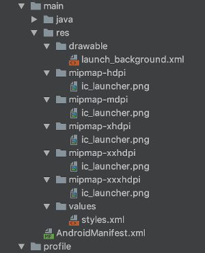
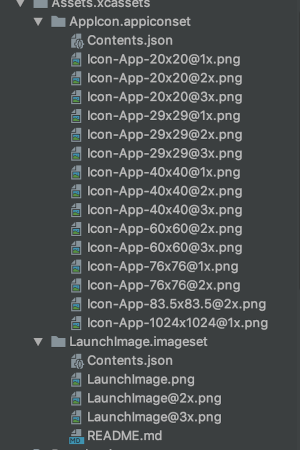

Android 8.0 より Adaptive Icon が採用され、Flutter でアイコンを設定するとき、
気をつけないと iOS と Androit のどちらかがうまく表示できてないといことが起こるので、その設定方法を残す。

注）この記事は未調査部分があるため、暫定的な内容となっている。

## とりあえず普通に作ってみる

Android Studio の Flutter plugin により、アイコンを作成してみる。当然、Adaptive Icon
には対応していない。

### android


### iOS


android は lc_launcher.png を、iOS は Icon-App-XXXXXX.png を置き換える。Android は
Android Studio に付属の [Image Asset Studio](https://developer.android.com/studio/write/image-asset-studio?hl=JA)を使用することになるが、Flutter プロジェクトの場合、メニューに出てきてくれないので、新たに Android プロジェクトを作成し、そこに作成したアイコンを置いて
Adaptive Icon を生成した（めんどくさい）。

iOS の場合、いろんなサイズの画像を用意するのが大変なので、[App Icon Resizer](https://resizeappicon.com/) を使用したが、iOS で必要なアイコンの数が増えすぎてしまい、まだ足りないサイズがある。それは仕方ないので、[gimp](https://www.gimp.org/) で作成した。 

この際注意しないといけないのは、android は Adaptive Icon でアルファチャンネルを使用するが、
iOS はアルファチャンネルを無視するので、アルファチャンネルの色を背景色にするか、アルファチャンネルありとなしの画像２種類を用意しなくてはならない（大体の場合、２種類用意することになると思う）。

これだけの設定で android の場合、バックグラウンドアイコンがデフォルトのもの(app/src/main/res/drawable/launch_background.xml) が使用されるので、pubspec.yaml を以下のように設定する。

```yaml
flutter_icons:
  android: true
  ios: true
  image_path: "assets/icon/icon.png"
  adaptive_icon_foreground: "assets/icon/adaptive_icon.png"
  adaptive_icon_background: "#FFFFFF"
```
