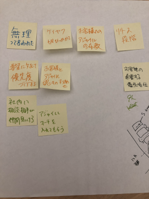

以前、スクラムのプロジェクトをやっていたことがあり、自分でも広められないかと思い、
[Screum Masters Night](https://smn.connpass.com/event/141659/) へ行ってきました。参加するのは、全くの初めてです。

# 初学者向け座学

スクラムの概要についてスライドで教えてもらいました。スクラム（の方針なのかはわかりませんが）では、資料の配布は行わないそうです。スクラムの実践はそれぞれのチームで考えるものであり、特定の方針に引っ張られてはいけないという考え方であると理解しました。

内容的には、スクラムにおけるロール、イベント、成果物の名前やその説明でした。一応、スクラムの経験はあったので割とすっと理解できたかと思います。

# アジェンダ1 最高のチームとは

座学が終わるとOST(Open Space Technology) に参加しました。「２本足の掟」というのがあり、自由に自分の気になった議論に参加するのですが、自分が学習も貢献もできないとなると２本の足で移動するということらしいです。要は、その場にいるだけの人を作らないということらしいです。

最初の議題としては、最高のチームとはどういうものかというものでした。ざっくりとした議題なのですが、いくつかメトリックの取り方のヒントみたいなものを出されていました。

# アジェンダ2 どういったときスクラムがうまく行っていると思うか

２つ目の議題は、前の議題に関連してる話で、どういったときにうまく行ってると思うかということでした。成功例というのはいいですね。PO(プロダクトオーナー)、SM(スクラムマスター)、開発チームそれぞれの立場から意見が出ました。POとしてはベロシティーで、SMとしてはチームが楽しいそう、開発チームとしては、相互に協力して進められているという意見が出ました。なるほど。

# アジェンダ3 業務委託でスクラムはワークするか

これは自分で発案した話でもあった（もう一人同じ議題の方がおられたようです）にも関わらず、参加できませんでした。あとでボードを見せてもらいました。

自分では、多分うまくいかないだろうなと思いっていたのですが、可能性としてはあるようなので、働きかけてみる価値はあるように思いました。もちろん、ダメな場合もあるとは思います。

# 懇親会

懇親会では、OST で話さなかった方と話をしました。少し意外だったのは、心理的安全性に否定的な方がおられたことです。心理的安全性はスクラムのスコープ外の気がしますが、同じコンテキストで話されることが多いように思うので意外な気がしました。この件もいつか話してみたいです。

あと、JIRA も否定的な意見がありました。確かにツールの使用はあまり推奨されてないような気はしますが、どうなんでしょう。費用対効果という点では、そういうこともあるかもしれないです。

いろいろありましたが、知見の宝庫であり、普段議論に参加するという経験が極端にないため、新鮮だったし、勉強になった気がします。今後も積極的に参加したいと思いました。

